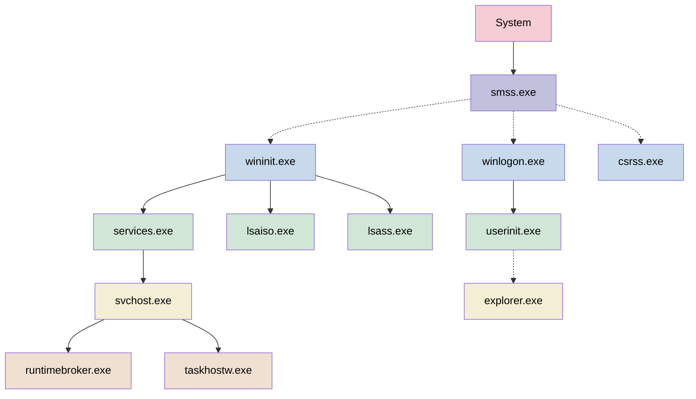

# Windows Memory Forensics
## Verify Hashes before doing anything else!
```posh
Get-FileHash -Algorithm MD5 -Path path\to\memory\dump
```

## Windows Process Genealogy



- smss.exe: One master instance and another child instance per session. Children exit after creating their session.
- lsasio.exe: When Credential Guard is enabled, the functionality of lsass.exe is split between two processes –
itself and lsaiso.exe. Most of the functionality stays within lsass.exe, but the important role of safely storing
account credentials moves to lsaiso.exe
- explorer.exe: Created by an instance of userinit.exe that exits

| Image Name        | Path                                        | Instances           | User Account | Start Time                      |
|-------------------|---------------------------------------------|---------------------|--------------|---------------------------------|
| System            | N/A                                         | 1                   | SYSTEM       | System boot time                |
| smss.exe          | %SystemRoot%\System32\smss.exe              | 1                   | SYSTEM       | System boot time                |
| csrss.exe         | %SystemRoot%\System32\csrss.exe             | 2 or more           | SYSTEM       | System boot time                |
| wininit.exe       | %SystemRoot%\System32\wininit.exe           | 1                   | SYSTEM       | System boot time                |
| winlogon.exe      | %SystemRoot%\System32\winlogon.exe          | 1 or more           | SYSTEM       | System boot time                |
| services.exe      | %SystemRoot%\System32\services.exe          | Multiple            | SYSTEM       | System boot time                |
| lsaiso.exe        | %SystemRoot%\System32\lsaiso.exe            | 0 or 1              | SYSTEM       | System boot time                |
| lsass.exe         | %SystemRoot%\System32\lsass.exe             | 1                   | SYSTEM       | System boot time                |
| userinit.exe      | %SystemRoot%\System32\userinit.exe          | 1                   | USER         | User logon time                 |
| svchost.exe       | %SystemRoot%\system32\svchost.exe           | Multiple            | SYSTEM       | Generally system boot time      |
| explorer.exe      | %SystemRoot%\explorer.exe                   | 1 per logged in user| USER         | User logon time                 |
| runtimebroker.exe | %SystemRoot%\System32\RuntimeBroker.exe     | 1                   | USER         | Varies                          |
| taskhostw.exe     | %SystemRoot%\System32\taskhostw.exe         | Multiple            | USER         | Varies                          |


## Volatility3

Windows Info	
```posh
#Includes x32/x64 determination, major and minor OS versions, and kdbg information
python vol.py -f “/path/to/file” windows.info
```

Process Information
```posh
#Volatility 3: Does not include a direct psxview equivalent. psxview shows hidden processes
vol.py -f “/path/to/file” windows.pslist
vol.py -f “/path/to/file” windows.psscan
vol.py -f “/path/to/file” windows.pstree
```

Dump Process by PID
```posh
#Volatility 3: Dumps exe and associated DLLs
python vol.py -f “/path/to/file” -o “/path/to/dir” windows.dumpfiles ‑‑pid <PID>
```

Dump Process Memory by PID
```posh
#Dumps memory associated with a particular PID
python vol.py -f “/path/to/file” -o “/path/to/dir” windows.memmap ‑‑dump ‑‑pid <PID>
```

Handles
```posh
#Volatility 3: PID, process, offset, handlevalue, type, grantedaccess, name
python vol.py -f “/path/to/file” windows.handles ‑‑pid <PID>
```

DLLs
```posh
#Volatility 3: PID, process, offset, handlevalue, type, grantedaccess, name
python vol.py -f “/path/to/file” windows.dlllist ‑‑pid <PID>
#ldrmodules, look for DLL's with FALSE, FALSE, FALSE
python vol.py -f “/path/to/file” windows.ldrmodules ‑‑pid <PID>
```

CMDLINE
```posh
#Volatility 3: PID, process name, args
python vol.py -f “/path/to/file” windows.cmdline
```

Network Information [^network]
[^network]:[Network Connection Timestamps in Memory](https://illusive.com/blog/threat-research-blog/why-and-how-to-extract-network-connection-timestamps-for-dfir-investigations/)
```posh
#Network connections associated with the memory dump
#netscan also includes a creation timestamp becuase it accesses the kernel pool, whereas netstat is usermode
vol.py -f “/path/to/file” windows.netscan
vol.py -f “/path/to/file” windows.netstat
```

Registry
```posh
#hivelist
vol.py -f “/path/to/file” windows.registry.hivescan
vol.py -f “/path/to/file” windows.registry.hivelist
#printkey
vol.py -f “/path/to/file” windows.registry.printkey
vol.py -f “/path/to/file” windows.registry.printkey ‑‑key “Software\Microsoft\Windows\CurrentVersion”
#hivedump is only available in volatility2, however, you may be able to extract registry hives using filedump with the offset
```

Files
```posh
#filescan
vol.py -f “/path/to/file” windows.filescan
#filedump
vol.py -f “/path/to/file” -o “/path/to/dir” windows.dumpfiles
vol.py -f “/path/to/file” -o “/path/to/dir” windows.dumpfiles ‑‑virtaddr <offset>
vol.py -f “/path/to/file” -o “/path/to/dir” windows.dumpfiles ‑‑physaddr <offset>
```

Malfind
```posh
#Volatility 3: PID, process name, process start, protection, commit charge, privatememory, file output, hexdump disassembly
vol.py -f “/path/to/file” windows.malfind
```

Yara
```posh
#yarascan
vol.py -f “/path/to/file” windows.vadyarascan ‑‑yara-rules <string>
vol.py -f “/path/to/file” windows.vadyarascan ‑‑yara-file “/path/to/file.yar”
vol.py -f “/path/to/file” yarascan.yarascan ‑‑yara-file “/path/to/file.yar”
```

## MemProcFS [^memprocfs]
[^memprocfs]:[MemProcFS Wiki](https://github.com/ufrisk/MemProcFS/wiki)

Includes pagefile support. 
```posh
memprocfs -Device path\to\memory\file -Pagefile path\to\page\file -Forensic -v 
```

### .\forensic
Only works with -Forensic
MemProcFS forensics performs the batch oriented comprehensive analysis tasks and outputs the result into a sqlite database and displays the result in the forensic sub-directory. Analysis tasks include (but are not limited to):
 - NTFS MFT scanning.                                                       
 - Timeline analysis of Processes, Registry, NTFS MFT, Plugins and more. 
### .\forensic\ntfs
The directory contains a best-effort reconstructed file system reconstructed from NTFS MFT entries located in physical memory. If the files are small enough contents may reside within the NTFS MFT and may be recoverable by opening the file.
### .\forensic\findevil
FindEvil locates signs of malware by analyzing select indicators of evil. FindEvil swiftly discovers certain code injection techniques commonly employed by malware while it is completely unaware of other not-yet implemented indicators.

FindEvil is work in progress. FindEvil will miss certain types of malware while quickly locating others. FindEvil only detects user-mode malware. FindEvil have false positives in its current implementation. FindEvil is only available on 64-bit Windows 11, 10 and 8.1.
### .\forensic\csv

The directory contains a comma separated (csv) files that may be used to import into Excel or Timeline Explorer. Timestamps are in UTC.

| File                      | Description                                   |
| ------------------------- | --------------------------------------------- |
| drivers.csv               | Kernel drivers.                               |
| handles.csv               | Handles related to all processes.             |
| modules.csv               | Loaded modules information.                   |
| process.csv               | Process information.                          |
| services.csv              | Services (user mode and kernel drivers).      |
| tasks.csv                 | Scheduled Tasks.                              |
| threads.csv               | Information about all threads on the system.  |
| timeline_all.csv          | Amalgamation of all timelines.                |
| timeline_kernelobject.csv | Kernel object manager objects.                |
| timeline_net.csv          | Network timeline.                             |
| timeline_ntfs.csv         | NTFS MFT timeline.                            |
| timeline_process.csv      | Process timeline.                             |
| timeline_registry.csv     | Registry timeline.                            |
| timeline_task.csv         | Scheduled Tasks timeline.                     |
| timeline_thread.csv       | Threading timeline.                           |
| timeline_web.csv          | Web timeline.                                 |
| unloaded_modules.csv      | Unloaded modules information.                 |

### .\misc\bitlocker
The bitlocker plugin is loosely based on the excellent [bitlocker volatility](https://github.com/breppo/Volatility-BitLocker) plugin. The MemProcFS plugin uses the same underlying technique of identifying potential bitlocker keys by pool tagging and other heuristics. The MemProcFS plugin also does some post-processing to increase output quality.

The bitlocker plugin works quite well on Windows 7 and Windows 10/11. Issues however exists on Windows 8 (and early Windows 10) versions where multiple keys may be recovered in error. At least one key should however most often be correct even on Windows 8 and early Windows 10 versions.

In order to mount a recovered bitlocker key it's recommended to use dislocker on a Linux system. Please use the recovered _.fvek_ key.
```bash
dislocker -k <recovered_key>.fvek /path/to/disk /path/to/dislocker          
mount /path/to/dislocker/dislocker-file /path/to/mount
```

### .\misc\findevil
Indicators of Evil
FindEvil is only available on 64-bit Windows 11, 10 and 8.1.
| Indicator     | Description |
| ------------- | ----------- |
| PE_INJECT     | PE_INJECT locates malware by scanning for valid .DLLs and .EXEs with executable pages in their page tables located in a private (non-image) virtual address descriptor. |
| PEB_MASQ      | PEB_MASQ will flag PEB Masquerading attempts. If PEB_MASQ is detected please investigate further in /sys/proc/proc-v.txt |
| PEB_BAD_LDR   | BAD_PEB_LDR will flag if no in-process modules are enumerated from the PEB/LDR_DATA structures. |
| PROC_BAD_DTB  | PROC_BAD_DTB will flag active processes with an invalid DirectoryTableBase (DTB) in the kernel _EPROCESS object. |
| PROC_NOLINK   | PROC_NOLINK will flag if the process does not exist in the kernel _EPROCESS linked list. |
| PROC_PARENT   | PROC_PARENT will flag if a well known process has a bad parent process. |
| PROC_USER     | PROC_USER may trigger if well known processes are executing as a strange user. Example cmd.exe as SYSTEM. |
| PE_NOLINK     | PE_NOLINK locates malware in image virtual address descriptors which is not linked from the in-process PEB/Ldr lists. |
| PE_PATCHED    | PE_PATCHED locates malware in image virtual address descriptors which executable pages (in the page tables) differs from kernel prototype memory. |
| DRIVER_PATH   | DRIVER_PATH flag kernel drivers that are loaded from a non-standard path. DRIVER_PATH also flag if no corresponding module could be located. |
| PRIVATE_RWX   | PRIVATE_RWX locates malware with read/write/execute (RWX) pages in the page table which belongs to a private memory virtual address descriptor. |
| NOIMAGE_RWX   | NOIMAGE_RWX locates malware with read/write/execute (RWX) pages in the page table which does not belong to image (module) virtual address descriptors. |
| PRIVATE_RX    | PRIVATE_RX locates malware with read/execute (RX) pages in the page table which belongs to a private memory virtual address descriptor. |
| NOIMAGE_RX    | NOIMAGE_RX locates malware with read/execute (RX) pages in the page table which does not belong to image (module) virtual address descriptors. |

### .\misc\web
The directory contains web browser related information such as browser history from supported web browsers.

| Supported Browser     |
| --------------------- |
| Google Chrome         |
| Microsoft Edge (new)  |
| Firefox               |

### .\registry\hive_files
Entire registry hives that can be processed by other tools like Registry Explorer or RegRipper

### .\sys
The directory contains directories and files displaying various system information.
The files in the **sys** directory are listed in the table below:
| File              | Description                                                             |
| ----------------- | ----------------------------------------------------------------------- |
| computername.txt  | Name of the computer                                                    |
| time-boot.txt     | Time of system boot                                                     |
| time-current.txt  | Time of system                                                          |
| timezone.txt      | TimeZone of system                                                      |
| unique-tag.txt    | MemProcFS derived ID for the current memory image                       |
| version.txt       | Operating system version on format: major.minor.build                   |
| version-major.txt | Operating system major version                                          |
| version-minor.txt | Operating system minor version                                          |
| version-build.txt | Operating system build number                                           |

### .\sys\net
Contains a listing of active TCP connections similar to netstat -ano
Does not give connection times like volatility

### .\sys\proc
The file proc.txt contains a per-pid tree view of the known processes in the system. The view includes all processes including terminated ones.

### .\sys\services
Contains information about services extracted from the service control manager (SCM)
The files in the **sys/services** directory are listed in the table below:
| File                           | Description                                               |
| ------------------------------ | --------------------------------------------------------- |
| __services.txt__               | Summary information about all services listed by ordinal. |
| by-id/[id]/registry/           | Service registry key.                                     |
| by-id/[id]/__svcinfo.txt__     | Detailed information about each service.                  |
| by-name/[name]/registry/       | Service registry key.                                     |
| by-name/[name]/__svcinfo.txt__ | Detailed information about each service.                  |

### .\sys\tasks
Contains information about scheduled tasks extracted from the registry.

### .\sys\users
information about the users on the system.
```
   # Username                         SID
-----------------------------------------
0000 SANSDFIR                         S-1-5-21-1552841522-3835366585-4197357653-1001
...
```
## MemProcFS-Analyzer
MemProcFS-Analyzer is a PowerShell script that mounts the memory file and then runs forensic tools against the mount in an automated fashion. Supports pagefile
Instead of relying on this script, you could potentially run the elements of the script manually, which would give you more more power in how those tools get run.
Things that the script checks that don't rely on third party tools:
- Checking for Suspicious Port Numbers
	- Source
		- 3262 (F-Response)
		- 3389 (RDP)
		- 4444 (Meterpreter)
		- 4899 (Radmin-Server (Remote Desktop))
	- Destination
		- 20 (FTP)
		- 21 (FTP)
		- 3389 (RDP)
		- 4899 (Radmin-Server (Remote Desktop))
		- 17301 Radmin-VPN (RvControlSvc.exe)
		- 8080 (Potential C2)
		- 8081 (Potential C2)
		- 9001 (Tor)
		- 9030 (Tor)
		- 9150 (Tor)
- Checking Processes for Unusual Parent-Child Relationships
	- csrss.exe
	- LogonUI.exe
	- lsass.exe
	- services.exe
	- smss.exe
	- spoolsv.exe
	- svchost.exe
	- taskhost.exe
	- taskhostw.exe
	- userinit.exe
	- wininit.exe
	- winlogon.exe
- Unusual Number of Process Instances (>1)
	- lsaiso.exe
	- lsass.exe
	- lsm.exe
	- Memory Compression
	- Registry
	- services.exe
	- System
	- wininit.exe
- Checking Processes for Unusual User Context
	```
 	# svchost.exe is supposed to run in Session 0 under one of 3 users: SYSTEM, LOCAL SERVICE or NETWORK SERVICE.
	# If svchost.exe is ran by SYSTEM, NETWORK SERVICE or LOCAL SERVICE, then it should be legitmate, but if it is ran under an user account, 
	# then you need to investigate if the svchost.exe file is from another location than "C:\Windows\System32". 
	```			
- Checking for processes spawned from suspicious folder locations
	- Desktop
	- Downloads
	- Documents
	- Public
	- Temp
	- ALLUSERSPROFILE
	- C:\
	- LocalAppData
	- LocalLow
	- Roaming
- Checking for Process Path Masquerading and Process Name Masquerading. Measures the edit distance between used Process Name and Original Windows Process Name
- Checking for suspicious parent processes
	- rundll32.exe spawns conhost.exe
	- svchost.exe spawns cmd.exe
- Checking for suspicious child processes
	- WINWORD.EXE spawns cmd.exe
	- WINWORD.EXE spawns powershell.exe
	- WINWORD.EXE spawns mshta.exe
	- WINWORD.EXE spawns regsvr32.exe
- Checking for processes with suspicious command-line arguments
	- Powershell
		- base64 encoded command
		- WindowStyle Hidden
		- Execution Policy Bypass
		- Profile Bypass
		- NonInteractive Mode
		- Download
		- Invoke-Expression
		- Start-Process
	- cmd.exe
    	- The /c parameter is used to terminate the shell after command completion.
        - The /q parameter is used to turn echo off.
        - The /k parameter is used to run a command and then remain open (e.g. whoami).
- Checking for suspicious processes without any command-line arguments
	- svchost.exe
	- rundll32.exe
- Service running from a suspicious folder location: C:\Users\*\AppData\Local\Temp\*
- Task Scheduler running from a suspicious folder location
	- C:\Users\*
	- C:\ProgramData\*
	- C:\Windows\Temp\*
	- C:\TMP\*
- Task Scheduler running using suspicious Scripting Utility
- Task Scheduler running malicious command line argument

### AmcacheParser [^amcache]
[^amcache]:[AmcacheParser](https://thesecuritynoob.com/dfir-tools/dfir-tools-amcacheparser-what-is-it-how-to-use/)

Amcache.hve is a small registry hive that stores a wealth of information about recently run applications and programs, including full path, file timestamps, and file SHA1 hash value, it is commonly found at the following location: 
```C:\Windows\AppCompat\Programs\Amcache.hve```

### AppCompatCacheParser[^AppCompatCacheParser]
[^AppCompatCacheParser]:[AppCompatCacheParser](https://thesecuritynoob.com/dfir-tools/dfir-tools-amcacheparser-what-is-it-how-to-use-2/)

Shimcache, also known as AppCompatCache, is a component of the Application Compatibility Database, which was created by Microsoft and used by the Windows operating system to identify application compatibility issues. This helps developers troubleshoot legacy functions and contains data related to Windows features. It is used for quick search to decide whether modules need shimming for compatibility or not.

A Shim is a small library that transparently handles the applications interworking’s to provide support for older APIs in a newer environment or vice-versa. Shims allow backwards and forwards compatibility for applications on different software platforms.

The Registry Key related to this cache can be found and located as below.

```HKLM\SYSTEM\CurrentControlSet\Control\SessionManager\AppCompatCache\AppCompatCache```

### EvtxECmd
A Windows Event Log file parser that bypasses the Windows API.  There are a lot of advantages to a tool such as this; specifically by bypassing the API it doesn't succumb to the 'hiccups' that may occur as a result of files that weren't closed properly or for some other reason isn't formatted in a manner the API agrees with. This is especially important for memory forensics.

### IpInfo CLI
Takes all public IP addresses found in ``` .\sys\net ``` and generates GeoIP information on them.
Consider using [Abeebus](https://github.com/13Cubed/Abeebus) and [Rebeebus](https://github.com/13Cubed/Rebeebus) against this data set too.

### lnk_parser
Yara is run against ``` .\forenisc\ntfs\ ``` to pull all .lnk files. lnk_parser then generates a CSV that contains the following items
- LNK Full Path
- LNK Modification Time
- LNK Access Time
- LNK Creation Time
- Target Full Path
- Working Directory
- Arguments
- Relative Path
- Icon Location
- Local Base Path
- Shortcut Key
- LNK Size
- MD5
- SHA1
- SHA256
- Entropy

It then uses this CSV to hunt for known suspicious/malicious lnk files. These include:
- ```C:\Google\AutoIt3.exe```
- ```C:\Windows\System32\cmd.exe```
- ```C:\Windows\System32\mshta.exe```
- ```C:\Windows\System32\msiexec.exe```
- ```C:\Windows\System32\WindowsPowerShell\v1.0\powershell.exe```
- ```C:\Windows\System32\rundll32.exe```
- ```C:\Windows\System32\schtasks.exe```
- ```C:\Windows\System32\wscript.exe```
- Long arguments (more than 50 characters)
- Long whitespace (more than 3 characters)
- LNK contains http:// or https://
- suspicious LNK file size
- Entropy > 6.5

### RECmd
RECmd is a command-line tool is useful to access, search and recover, and export any data found in the Windows registry.
Is the command-line version of GUI app RegistryExplorer, with which it shares the same plugins.
In this context, the following items are of interest:
- Syscache 
- UserAssist 
- ShellBags 
- Auto-Start Extensibility Points (ASEPs)
- RecentDocs, Office Trusted Document
- BAM
- MUICache

### SBECmd
SBECmd allows for processing Shellbags via command-line and can process multiple registry hives simultaneously.

### YARA
YARA is included in the analyzer but appears to be under-utilized only searching for LNK files. 
This could be expanded to search for specfic files or strings within the memory dump

### Zircolite
Zircolite is a standalone tool written in Python 3. It allows to use SIGMA rules on MS Windows EVTX (EVTX and JSONL format), Auditd logs and Sysmon for Linux logs.
Able to assign MITRE ATT&CK tactics to the event log hits it returns.

### ClamAV
ClamAV is an open source antivirus engine for detecting trojans, viruses, malware & other malicious threats. 

### 1768.py
Checks for Cobalt Strike Beacons

## Other Tools
### Chainsaw
Chainsaw provides a powerful ‘first-response’ capability to quickly identify threats within Windows forensic artefacts such as Event Logs and MFTs. Chainsaw offers a generic and fast method of searching through event logs for keywords, and by identifying threats using built-in support for Sigma detection rules, and via custom Chainsaw detection rules.
